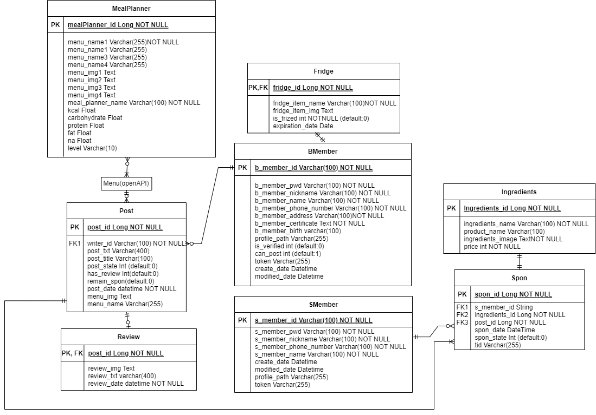

# **모두의 한 끼(Meal_For_All)**

 

### 자립 준비 청년의 한끼를 위해 식단과 레시피를 제공하고, 식재료를 후원하는 기부 플랫폼

 

- - -
## **E-R Diagram**

 

- - -

## **open API**

메뉴 레시피: [식품의약품안전처 공공데이터 활용][googlelink]

[googlelink]: http://www.foodsafetykorea.go.kr/api/openApiInfo.do?menu_grp=MENU_GRP31&menu_no=661&show_cnt=10&start_idx=1&svc_no=COOKRCP01

SNS 로그인: [카카오 로그인][kakao login]

[kakao login]: https://developers.kakao.com/docs/latest/ko/kakaologin/common

후원 결제: [카카오 페이][kakao pay]

[kakao pay]: https://developers.kakao.com/docs/latest/ko/kakaopay/common

- - -