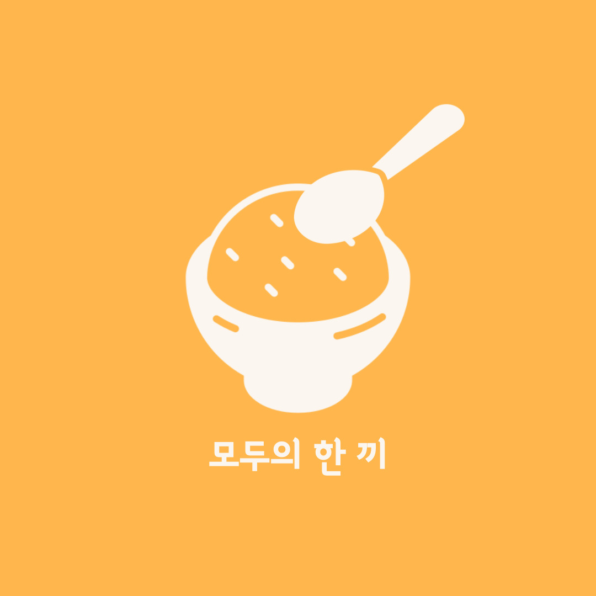
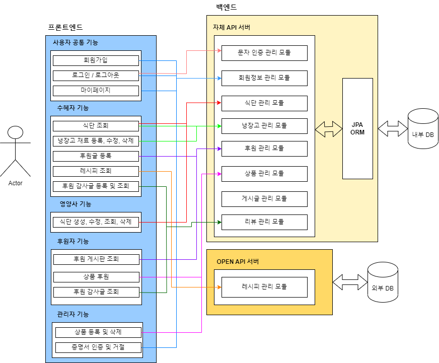

# **모두의 한 끼(Meal_For_All)**

 

#### 자립 준비 청년의 한끼를 위해 식단과 레시피를 제공하고, 식재료를 후원하는 기부 플랫폼

### Front

### Back / DevOps 

 

 

### Communication / SCM

 

## 목차
- [ 개요 ](#개요)
- [ E-R Diagram](#e-r-diagram)
- [ 기능 흐름도](#기능-흐름도)
- [ 서비스 흐름도](#서비스-흐름도)
- [ 에러 코드](#에러-코드)
- [ open API](#open-api)
- [ Members](#members)

- - -
## 개요
- 2023 공개 SW 개발자 대회 출품작
- 팀명 : Spoonsors
- 프로젝트명 : 모두의 한 끼

- - -
## **E-R Diagram**

 

- - -
## **서비스 흐름도**

 

- - -

## **기능 흐름도**

.jpg)

 

 

- 자립 준비 청년
    1. 로그인 후, 식단 또는 레시피에 접근하여 필요한 식재료들을 파악한다.
    2. 간단한 텍스트 작성과 함께 필요한 식재료를 선택하여 글을 올린다.
    3. 자신의 글에 모든 후원이 등록 되면 식재료 배송이 시작된다. 일부만 등록되어 있을 경우, 글 마감을 선택하여 배송을 요청할 수도 있다. 
    4. 식재료가 집에 도착하면 사용자는 레시피대로 음식을 해먹고 리뷰를 작성한다. 후원을 받았음에도 리뷰를 작성하지 않으면 다음 글 작성이 불가능하다.
- 후원자
    1. 로그인 후, 자립 준비 청년이 올린 후원 요청 글을 확인한다.
    2. 글에 등록된 필요한 식재료 중 후원을 희망하는 식재료를 선택하여 결제한다. 
    3. 자립 준비 청년이 리뷰를 등록하면, 후원자에게 알림이 가서 이를 확인할 수 있다.

- - -

## **에러 코드**

 

- - -

## **open API**

메뉴 레시피: [식품의약품안전처 공공데이터 활용][googlelink]

[googlelink]: http://www.foodsafetykorea.go.kr/api/openApiInfo.do?menu_grp=MENU_GRP31&menu_no=661&show_cnt=10&start_idx=1&svc_no=COOKRCP01

SNS 로그인: [카카오 로그인][kakao login]

[kakao login]: https://developers.kakao.com/docs/latest/ko/kakaologin/common

후원 결제: [카카오 페이][kakao pay]

[kakao pay]: https://developers.kakao.com/docs/latest/ko/kakaopay/common

문자 인증: [네이버 클라우드 플랫폼][ncloud]

[ncloud]: https://www.ncloud.com/product/applicationService/sens

- - -

## **Members**
<table>
<tr align="center">
    <th>정태승</th>
    <th>최진우</th>
    <th>문혜영</th>
    <th>전민영</th>
</tr>
<tr align ="center">
   <td> </td>
  <td> </td>
    <td></td>
  <td></td>
</tr>
<tr align ="center">
    <td>Front</td>
    <td>Front</td>
    <td>Back</td>
    <td>Back</td>
</tr>
</table>

